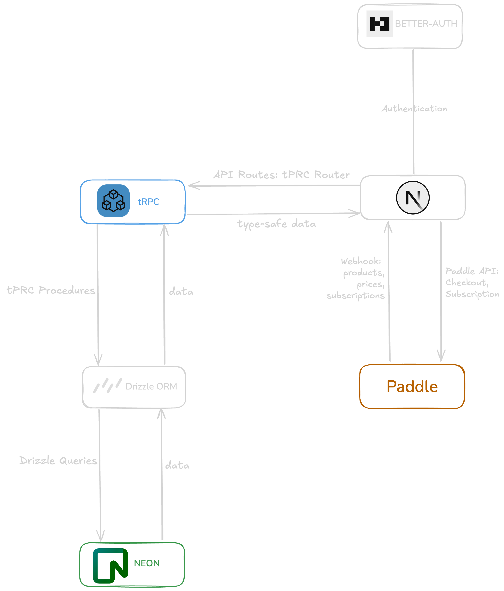

# Next.js Starter Template Paddle

A modern full-stack starter template with authentication, database, payments, and UI components.

## Tech Stack

| Category       | Technology                                                                           |
| -------------- | ------------------------------------------------------------------------------------ |
| Framework      | [Next.js](https://nextjs.org/)                                                       |
| Styling        | [tailwindcss](https://tailwindcss.com/)                                              |
| Components     | [Shadcn](https://ui.shadcn.com/)                                                     |
| Authentication | [Better-Auth](https://www.better-auth.com/)                                          |
| Database       | [Neon PostgreSQL](https://neon.tech/home)                                            |
| ORM            | [Drizzle](https://orm.drizzle.team/)                                                 |
| API Layer      | [tRPC](https://trpc.io/) + [TanStack React Query](https://tanstack.com/query/latest) |
| Payments       | [Paddle](https://www.paddle.com/)                                                    |
| Rate Limiting  | [Upstash](https://upstash.com/)                                                      |
| Email          | [Resend](https://resend.com/home)                                                    |

## Getting Started

### Prerequisites

- Node.js 16.8 or later
- pnpm (recommended) or npm
- Git

### Installation Steps

1. **Download the template**

```bash
git clone https://github.com/yzy98/nextjs-starter-template-paddle.git
cd nextjs-starter-template-paddle
pnpm install
```

2. **Set up .env**

copy `.env.example` to `.env`, and fill in the values according to the comments in the `.env.example` file.
You need to initialize Better-Auth, Neon, Paddle, Upstash and Resend projects.

3. **Initialize Database**

```bash
pnpm db:push
```

You can go to your Neon project dashboard to check if all User, Product, Price and Subscription tables have been created.

## Features

- 🎯 Styled with Tailwind CSS
- 🎨 Beautiful UI components with Shadcn
- 🔐 Authentication with Better-Auth
- 🗄️ PostgreSQL Database with Neon
- 💳 Payment processing with Paddle
- 🔄 Real-time webhook handling
- 🚀 Type-safe ORM with Drizzle
- ⚡️ TRPC and TanStack Query for end-to-end type-safe API
- 📋 Table management with TanStack Table
- 🛡️ Upstash for rate limiting

## Architecture



## Project Structure

```
├── app/
│   ├── api/
│   │   └── billing/
│   │   |   └── webhook/route.ts
|   |   |── auth/
|   |   └── trpc/
│   ├── sign-in/
│   ├── sign-up/
│   ├── dashboard/
│   ├── pricing/
│   ├── checkout/
│   |   ├── [priceId]/
│   |   └── success/
│   ├── (mdx-page)/
│   |   └── layout.tsx
│   |   └── privacy/
│   |   └── terms-of-use/
├── components/
│   ├── ui/
│   └── checkout/
│   └── dashboard/
│   └── layout/
│   └── pricing/
│   └── providers/
├── markdowns/
├── lib/
│   └── utils.ts
├── trpc/
├── server/
│   └── db/
│   └── paddle/
│   └── redis/
├── middleware.ts
├── .env
└── .env.example
```

## Webhook Setup

1. Sign up / in **_[Ngrok](https://dashboard.ngrok.com/signup)_**
1. Install ngrok in your local machine

using `homebrew`

```bash
brew install ngrok
```

or `npm`

```bash
npm install -g ngrok
```

3. Authenticate your ngrok agent

```bash
ngrok config add-authtoken $YOUR_AUTHTOKEN
```

4. Get a static domain in **_[Ngrok Dashboard](https://dashboard.ngrok.com/domains)_**, copy the domain as value of `NGROK_DOMAIN` inside `.env`

5. Configure Paddle webhook endpoint with the ngrok URL:

- URL: `<ngrok-domain>/api/billing/webhook`
- Events: `subscription.created`, `subscription.updated`, `subscription.canceled`

## Run the project

```bash
pnpm dev:all
```

You can now visit `http://localhost:3000` to see the project and test webhooks.

## Contributing

Contributions are welcome! Please feel free to submit a Pull Request.

## License

This project is licensed under the MIT License - see the [LICENSE](LICENSE) file for details.
